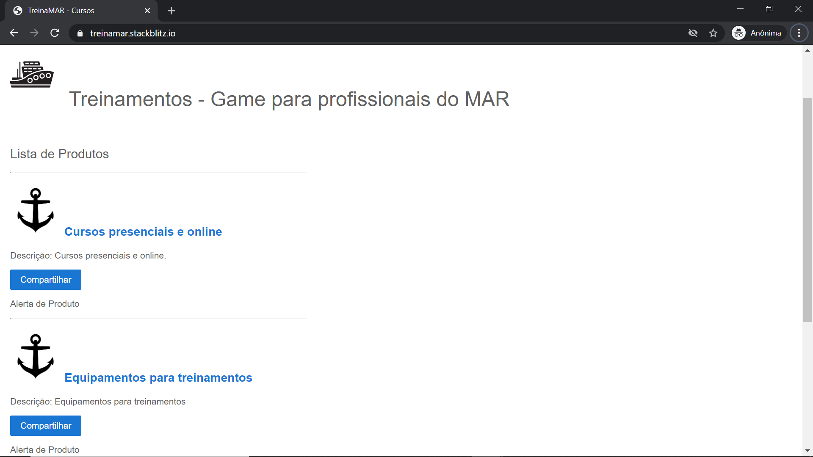

# plataforma

## Este repositório contém os codigos da plataforma hospedada na cloud

	A pasta treinamar contem a versao inicial da Front End criar em angular

	Utilizamos o StackBlits
		
		https://stackblitz.com/

	O site pode ser visualizado em:

		https://treinamar.stackblitz.io/

	A pasta treinamar-backend contém o código do backend em nodejs

	Para rodar o projeto, entrar na pasta e rodar os comandos:

	# npm install
	
	# npm start

